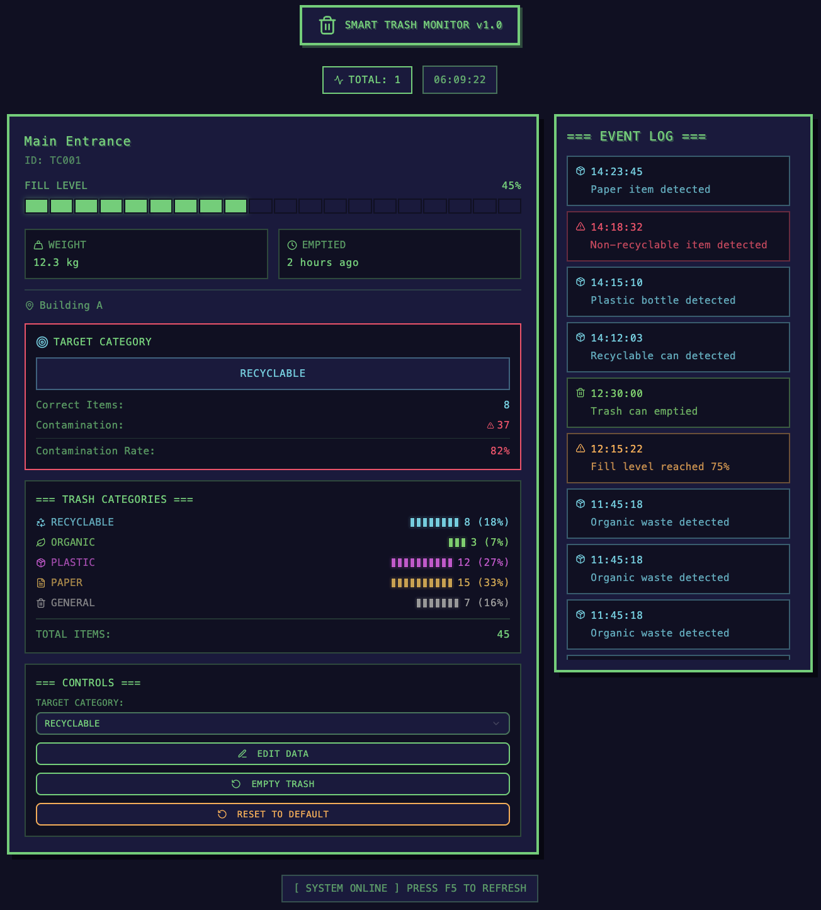

#  TrashCam  
### *AI-Powered Smart Trashcan — Computer Vision + Raspberry Pi + Retro UI*

TrashCam is an end-to-end **smart waste-monitoring system** using **computer vision**, **Raspberry Pi**, and a **retro-styled dashboard** to detect waste, analyze fill levels, track mis-sorting, and provide LED feedback on a real trash bin.

The system pipeline is:

> **Camera → Raspberry Pi → Laptop (AI + Retro UI) → Pi Disaplay**

---

##  Features

###  Live Camera Capture  
- Intel Navilense Camera
- Streams MJPEG/RTSP over LAN  
- Low-latency capture for tracking falling trash in real time

### AI Waste Classification  
- YOLOv8-World (or custom YOLO model)  
- Groups predictions into:
  - recycling   
  - organic  
  - general waste  
- Optional deduping avoids repeat logs for the same item

###  Retro Dashboard (React UI)  
- CRT-style “retro terminal” look  
- Displays:
  - **Fill level bar**
  - **Current detected trash**
  - **Mis-assignment %**
  - **Event log feed**
  - **Real-time device status**
- Works stand-alone (backend optional initially)

###  LED Feedback (Raspberry Pi)  
- WS2812B or Neopixel LEDs  
- Visual feedback for:
  - correct sorting  
  - contamination detected  
  - bin nearing full  
  - system errors / warnings  

###  Logging & Stats  
- JSON event logging  
- CSV analytics  
- Daily usage summaries  
- Mis-sort tracking for environment analysis  

---

## Tech Stack

### Frontend
- React  
- Retro CRT theme (CSS)  
- ShadCN UI  
- Live-updating stats & graphs  

### Backend (Python)
- FastAPI  
- OpenCV  
- YOLOv8-World inference  
- Logging + analytics  

### Hardware
- Raspberry Pi 5
- Intel Navilense Camear  
- WS2812B LED strip  
- Trash bin  

